# FillWork Backend v1.0

## 0. 문서 개요

- 상태: Phase 2 설계 초안
- 작성일: 2026-06-13
- 대상: NestJS, Prisma, PostgreSQL, Redis, AWS S3 기반 실서비스 전환
- 범위: 인증, 권한, 데이터 모델, API 계약
- 제외: 실제 서버 코드, Prisma migration, 외부 서비스 연결, 운영 배포

Phase 1의 Mock Data UI를 실제 서비스 구조로 전환하기 위한 백엔드 기준 문서다. 모든 업무 데이터는 `organization_id`로 격리하며, 사용자는 조직 멤버십을 통해 역할과 승인 상태를 가진다.

## 1. 핵심 설계 원칙

1. **조직 단위 멀티테넌시**: 모든 업무 데이터는 조직에 귀속하며 API 요청에서 조직 범위를 강제한다.
2. **최소 권한**: 전역 역할과 프로젝트 멤버십을 분리하고, 기본값은 거부로 처리한다.
3. **승인형 가입**: 회원가입 또는 Google 로그인 후 조직 관리자의 승인을 받아야 업무 데이터에 접근할 수 있다.
4. **감사 가능성**: 권한, 결재, 사용자 상태, 파일 공유 등 중요 변경은 `audit_logs`에 불변 이벤트로 기록한다.
5. **파일과 메타데이터 분리**: 바이너리는 S3, 접근 정책과 업무 메타데이터는 PostgreSQL에 저장한다.
6. **짧은 Access Token**: Access Token은 짧게 유지하고 Refresh Token을 회전해 탈취 피해를 제한한다.
7. **논리 삭제 우선**: 사용자 생성 콘텐츠는 `deleted_at`으로 보존하고, 법적·보안 요구가 있을 때 별도 파기 작업을 수행한다.

## 2. 인증 구조

### 2.1 인증 구성

| 구성 | 기준 |
|---|---|
| Access Token | JWT, 만료 15분, 메모리 보관 권장 |
| Refresh Token | 30일, HttpOnly + Secure + SameSite=Lax 쿠키 |
| Refresh Token 저장 | 원문 미저장, SHA-256 해시만 `sessions`에 저장 |
| 비밀번호 | Argon2id 해시, 최소 10자, 유출 비밀번호 차단 권장 |
| Google 로그인 | OAuth 2.0 / OpenID Connect, Authorization Code + PKCE |
| 세션 | 기기별 생성, Refresh Token 회전, 재사용 감지 시 토큰 계열 전체 폐기 |
| 계정 승인 | `PENDING -> ACTIVE` 전환 전 업무 API 접근 금지 |
| 계정 잠금 | 로그인 연속 실패 시 Redis 기반 점진적 제한 및 관리자 잠금 |
| 이메일 | 가입 확인, 승인 결과, 비밀번호 재설정에 일회성 링크 사용 |

### 2.2 이메일 로그인 흐름

1. 사용자가 이메일과 비밀번호로 가입한다.
2. 이메일 확인 토큰을 발급하고 확인 완료 후 계정을 `PENDING` 상태로 둔다.
3. 조직 Admin 이상에게 승인 알림을 보낸다.
4. 관리자가 조직, 팀, 역할을 지정하고 승인한다.
5. 사용자는 로그인 후 Access Token과 Refresh Token을 발급받는다.
6. `ACTIVE`가 아닌 계정은 제한된 상태 조회 API만 사용할 수 있다.

로그인 실패 응답은 계정 존재 여부를 노출하지 않도록 동일한 메시지를 사용한다. IP, 계정, 디바이스 지문별로 속도 제한을 적용한다.

### 2.3 Google 로그인 흐름

1. 프론트엔드가 서버에서 Google 인증 URL과 `state`, PKCE 값을 발급받는다.
2. Google callback에서 `state`, `nonce`, issuer, audience, 이메일 인증 여부를 검증한다.
3. 기존 `oauth_accounts`가 있으면 해당 사용자로 로그인한다.
4. 동일한 검증 이메일의 로컬 계정이 있으면 사용자 확인 후 계정을 연결한다. 자동 연결만으로 계정을 탈취할 수 없게 재인증 절차를 둔다.
5. 신규 사용자는 조직 초대 코드 또는 허용 도메인을 확인한 뒤 `PENDING` 계정을 생성한다.
6. 관리자 승인 후 일반 업무 API 접근을 허용한다.

### 2.4 관리자 승인

승인 단위는 사용자 자체가 아니라 **조직 멤버십**이다. 한 사용자가 여러 조직에 속할 수 있으며 조직마다 다른 역할과 상태를 가질 수 있다.

| 상태 | 의미 | 허용 범위 |
|---|---|---|
| `INVITED` | 초대 발송 | 초대 수락만 가능 |
| `PENDING` | 승인 대기 | 본인 상태, 로그아웃만 가능 |
| `ACTIVE` | 정상 사용 | 역할에 따른 API 허용 |
| `SUSPENDED` | 일시 정지 | 업무 API 차단 |
| `REJECTED` | 승인 거절 | 재신청 또는 지원 문의 |
| `LEFT` | 조직 탈퇴 | 과거 작성 이력은 보존 |

승인과 거절에는 처리자, 처리 시각, 사유를 저장하고 감사 로그를 생성한다.

### 2.5 비밀번호 재설정

1. 이메일 입력 시 계정 존재 여부와 무관하게 동일한 성공 응답을 반환한다.
2. 32바이트 이상의 무작위 토큰을 생성하고 해시만 DB에 저장한다.
3. 토큰은 30분 후 만료되며 한 번만 사용할 수 있다.
4. 새 비밀번호 설정 후 해당 사용자의 모든 세션을 폐기한다.
5. 변경 사실을 이메일과 인앱 알림으로 전달하고 감사 로그에 기록한다.

### 2.6 JWT Claims

```json
{
  "sub": "user_uuid",
  "sid": "session_uuid",
  "org": "organization_uuid",
  "role": "TEAM_LEADER",
  "ver": 3,
  "iat": 1781318400,
  "exp": 1781319300
}
```

권한이 변경되면 `token_version`을 증가시켜 기존 Access Token을 최대 15분 이내 무효화한다. 즉시 차단이 필요한 정지·탈퇴는 Redis denylist와 세션 폐기를 함께 사용한다.

## 3. 권한 체계

### 3.1 역할 정의

| 역할 | 범위 | 주요 권한 |
|---|---|---|
| `SUPER_ADMIN` | 플랫폼 전체 | 조직 관리, 플랜, 보안 정책, 전체 감사 조회 |
| `ADMIN` | 소속 조직 | 직원 승인, 조직·팀·권한, 전체 프로젝트와 통계 관리 |
| `TEAM_LEADER` | 소속 팀/프로젝트 | 프로젝트 생성, 팀 업무 배정, 결재 승인, 팀 통계 조회 |
| `FIELD_ENGINEER` | 배정 현장/프로젝트 | 현장 업무 처리, 사진·측정 결과 업로드, 고객 서명 등록 |
| `EMPLOYEE` | 배정 팀/프로젝트 | 문서·업무·채팅·파일의 일반 협업 기능 |

`SUPER_ADMIN`은 FillWork 운영자 전용이며 고객사 관리자가 아니다. 일반 고객 조직의 최고 권한은 `ADMIN`이다.

### 3.2 권한 매트릭스

| 리소스/행동 | Super Admin | Admin | Team Leader | Field Engineer | Employee |
|---|:---:|:---:|:---:|:---:|:---:|
| 조직 생성/플랜 변경 | O | - | - | - | - |
| 조직 설정/직원 승인 | O | O | - | - | - |
| 부서·팀·역할 관리 | O | O | 제한 | - | - |
| 전체 감사 로그 조회 | O | O | - | - | - |
| 프로젝트 생성 | O | O | O | - | 제한 |
| 프로젝트 조회 | O | O | 배정 범위 | 배정 범위 | 배정 범위 |
| 업무 배정/상태 변경 | O | O | O | 본인/배정 업무 | 본인/배정 업무 |
| 문서 생성/편집 | O | O | O | 권한 범위 | 권한 범위 |
| 현장 증빙 업로드 | O | O | O | O | 제한 |
| 결재 요청 | O | O | O | O | O |
| 결재 승인/반려 | O | O | 지정 결재선 | 지정 결재선 | 지정 결재선 |
| 조직 통계 조회 | O | O | 팀 범위 | 본인 범위 | 본인 범위 |

### 3.3 권한 판정 순서

1. 유효한 세션과 `ACTIVE` 사용자 여부 확인
2. 요청 조직과 JWT 조직의 일치 확인
3. 조직 멤버십 상태와 역할 확인
4. 리소스의 `organization_id` 확인
5. 프로젝트/채널/문서 멤버십 또는 공개 범위 확인
6. 리소스 소유권과 행위별 정책 확인
7. 민감 행위는 감사 로그 기록

NestJS에서는 `JwtAuthGuard -> OrganizationGuard -> PermissionGuard` 순서로 적용한다. Controller에 역할명을 직접 흩뿌리기보다 `@RequirePermission('project.manage')` 형태의 권한 키를 사용한다.

## 4. PostgreSQL 테이블 설계

### 4.1 공통 규칙

- 기본 키: UUID v7 또는 PostgreSQL UUID
- 시간: `timestamptz`, 서버와 DB는 UTC 저장
- 이름: DB는 `snake_case`, Prisma 모델은 `PascalCase`
- 멀티테넌트 테이블: `organization_id` 필수 및 복합 인덱스 구성
- 낙관적 잠금: 협업·결재 대상에 `version` 정수 사용
- 검색: 초기에는 PostgreSQL FTS와 `pg_trgm`, 규모 증가 시 OpenSearch 검토
- 개인정보: 이메일은 소문자 정규화하고 유니크 인덱스 적용
- 민감정보: 토큰 원문, OAuth access token, 파일 서명 URL은 영구 저장하지 않음

### 4.2 인증·조직 지원 테이블

| 테이블 | 핵심 컬럼 | 설명 |
|---|---|---|
| `organizations` | `id`, `name`, `slug`, `status`, `settings` | 고객사 테넌트 |
| `departments` | `id`, `organization_id`, `name`, `parent_id` | 계층형 부서 |
| `teams` | `id`, `organization_id`, `department_id`, `name` | 실무 팀 |
| `users` | `id`, `email`, `password_hash`, `name`, `status`, `token_version` | 전역 사용자 계정 |
| `organization_memberships` | `user_id`, `organization_id`, `team_id`, `role`, `status` | 조직별 역할·승인 상태 |
| `oauth_accounts` | `user_id`, `provider`, `provider_account_id` | Google 계정 연결 |
| `sessions` | `user_id`, `refresh_token_hash`, `family_id`, `expires_at` | 기기별 세션 |
| `password_reset_tokens` | `user_id`, `token_hash`, `expires_at`, `used_at` | 일회성 재설정 토큰 |

### 4.3 요청된 핵심 테이블

#### `users`

| 컬럼 | 타입 | 제약/용도 |
|---|---|---|
| `id` | uuid | PK |
| `email` | varchar(320) | 정규화, UNIQUE |
| `password_hash` | varchar(255) nullable | Google 전용 계정은 null 가능 |
| `name` | varchar(100) | 표시 이름 |
| `phone` | varchar(30) nullable | 암호화 또는 별도 PII 저장 검토 |
| `avatar_url` | text nullable | CDN URL |
| `status` | enum | `PENDING`, `ACTIVE`, `SUSPENDED`, `DELETED` |
| `token_version` | integer | 권한 변경 시 증가 |
| `last_login_at` | timestamptz nullable | 최근 로그인 |
| `created_at`, `updated_at`, `deleted_at` | timestamptz | 수명주기 |

#### `projects`

| 컬럼 | 타입 | 제약/용도 |
|---|---|---|
| `id`, `organization_id` | uuid | PK, tenant FK |
| `name`, `code` | varchar | 조직 내 `code` UNIQUE |
| `description` | text nullable | 프로젝트 설명 |
| `status` | enum | `PLANNING`, `ACTIVE`, `ON_HOLD`, `COMPLETED`, `ARCHIVED` |
| `priority` | enum | `LOW`, `NORMAL`, `HIGH`, `URGENT` |
| `leader_id` | uuid nullable | 책임자 |
| `site_address`, `site_lat`, `site_lng` | text/decimal nullable | 현장 정보 |
| `starts_at`, `due_at` | timestamptz nullable | 일정 |
| `progress` | smallint | 0~100 |
| `created_by`, `created_at`, `updated_at`, `deleted_at` | uuid/time | 감사 필드 |

칸반 업무는 `project_tasks` 지원 테이블로 분리한다. 업무 상태, 담당자, 마감일, 우선순위, 정렬 순서, 체크리스트를 저장한다.

#### `documents`

| 컬럼 | 타입 | 제약/용도 |
|---|---|---|
| `id`, `organization_id` | uuid | PK, tenant FK |
| `project_id`, `parent_id` | uuid nullable | 프로젝트/페이지 트리 |
| `title`, `icon`, `cover_url` | text | 문서 표현 |
| `content` | jsonb | Tiptap JSON 문서 |
| `plain_text` | text | 검색 인덱싱용 |
| `visibility` | enum | `PRIVATE`, `TEAM`, `PROJECT`, `ORGANIZATION` |
| `version` | integer | 낙관적 잠금 |
| `created_by`, `updated_by` | uuid | 편집자 |
| `created_at`, `updated_at`, `deleted_at` | timestamptz | 수명주기 |

버전 복원은 `document_versions`, 댓글은 `document_comments`, 실시간 공동 편집 상태는 Redis/Yjs 저장소로 분리한다.

#### `chats`

| 컬럼 | 타입 | 제약/용도 |
|---|---|---|
| `id`, `organization_id` | uuid | PK, tenant FK |
| `project_id` | uuid nullable | 프로젝트 채널 연결 |
| `type` | enum | `DIRECT`, `GROUP`, `CHANNEL`, `PROJECT` |
| `name`, `description` | text nullable | 채널 정보 |
| `is_private` | boolean | 비공개 여부 |
| `created_by` | uuid | 생성자 |
| `last_message_at` | timestamptz nullable | 목록 정렬 |
| `created_at`, `updated_at`, `archived_at` | timestamptz | 수명주기 |

멤버십은 `chat_members`, 메시지는 `chat_messages`, 이모지는 `message_reactions`, 읽음 위치는 `chat_members.last_read_message_id`로 분리한다.

#### `files`

| 컬럼 | 타입 | 제약/용도 |
|---|---|---|
| `id`, `organization_id` | uuid | PK, tenant FK |
| `project_id`, `folder_id` | uuid nullable | 업무/폴더 연결 |
| `uploaded_by` | uuid | 업로더 |
| `name`, `mime_type`, `extension` | text | 파일 정보 |
| `size_bytes` | bigint | 용량 |
| `storage_key` | text | S3 object key, 조직 내 UNIQUE |
| `checksum_sha256` | varchar(64) | 무결성·중복 확인 |
| `category` | enum | 일반/현장사진/속도측정/고객서명 등 |
| `tags`, `metadata` | text[]/jsonb | AI 태그·EXIF·현장 정보 |
| `version_no` | integer | 파일 버전 |
| `status` | enum | `UPLOADING`, `PROCESSING`, `READY`, `QUARANTINED`, `DELETED` |
| `created_at`, `updated_at`, `deleted_at` | timestamptz | 수명주기 |

업로드는 presigned URL을 사용한다. 업로드 완료 후 서버가 파일 크기, MIME, 체크섬을 검증하고 악성코드 검사 전에는 `READY`로 전환하지 않는다.

#### `approvals`

| 컬럼 | 타입 | 제약/용도 |
|---|---|---|
| `id`, `organization_id` | uuid | PK, tenant FK |
| `requester_id`, `project_id` | uuid | 요청자/프로젝트 |
| `title`, `description` | text | 결재 내용 |
| `type` | enum | 지출, 휴가, 작업완료, 기타 |
| `status` | enum | `DRAFT`, `PENDING`, `APPROVED`, `REJECTED`, `CANCELLED` |
| `current_step` | integer | 현재 결재선 |
| `payload` | jsonb | 유형별 확장 데이터 |
| `submitted_at`, `completed_at` | timestamptz nullable | 처리 시간 |
| `version` | integer | 중복 승인 방지 |
| `created_at`, `updated_at`, `deleted_at` | timestamptz | 수명주기 |

결재선은 `approval_steps`에 순서, 결재자, 상태, 의견, 처리 시각으로 저장한다. 상태 전이는 DB 트랜잭션과 행 잠금으로 처리한다.

#### `notifications`

| 컬럼 | 타입 | 제약/용도 |
|---|---|---|
| `id`, `organization_id`, `user_id` | uuid | 수신자 범위 |
| `type` | enum/string | 업무 배정, 멘션, 결재 등 |
| `title`, `body` | text | 표시 내용 |
| `data` | jsonb | 이동 경로와 리소스 ID |
| `channel` | enum | `IN_APP`, `EMAIL`, `PUSH` |
| `read_at`, `sent_at` | timestamptz nullable | 상태 |
| `created_at` | timestamptz | 생성 시각 |

대량 알림은 Outbox 패턴으로 생성하고 Worker가 전송한다. 동일 이벤트 중복 발송을 막기 위해 `dedupe_key`를 둔다.

#### `audit_logs`

| 컬럼 | 타입 | 제약/용도 |
|---|---|---|
| `id`, `organization_id` | uuid | PK, tenant FK |
| `actor_id` | uuid nullable | 사용자 또는 시스템 |
| `action` | varchar(100) | 예: `membership.approved` |
| `resource_type`, `resource_id` | varchar/uuid nullable | 대상 리소스 |
| `before`, `after` | jsonb nullable | 민감정보 제거 전후 값 |
| `ip_address`, `user_agent` | inet/text nullable | 요청 정보 |
| `request_id` | uuid | 추적 ID |
| `created_at` | timestamptz | 생성 시각 |

감사 로그는 UPDATE/DELETE API를 제공하지 않는다. 비밀번호, 토큰, 파일 원문, 서명 이미지 등 민감값은 기록하지 않는다.

### 4.4 주요 지원 테이블

- `project_members`: 프로젝트별 멤버와 권한
- `project_tasks`: 칸반 업무와 정렬 순서
- `document_versions`, `document_comments`: 버전과 댓글
- `chat_members`, `chat_messages`, `message_reactions`: 채팅 구성
- `file_folders`, `file_versions`, `file_permissions`, `file_links`: 파일 관리
- `approval_steps`: 순차/병렬 결재선
- `outbox_events`: 알림·후처리의 신뢰성 있는 비동기 발행

### 4.5 필수 인덱스

```text
users(lower(email)) UNIQUE
organization_memberships(organization_id, user_id) UNIQUE
organization_memberships(organization_id, status, role)
projects(organization_id, status, updated_at DESC)
project_tasks(project_id, status, sort_order)
documents(organization_id, parent_id, updated_at DESC)
chat_messages(chat_id, created_at DESC)
files(organization_id, folder_id, created_at DESC)
files(organization_id, category, created_at DESC)
approvals(organization_id, status, created_at DESC)
notifications(user_id, read_at, created_at DESC)
audit_logs(organization_id, created_at DESC)
audit_logs(resource_type, resource_id, created_at DESC)
```

## 5. Prisma Schema 초안

아래 스키마는 관계와 명명 규칙을 검증하기 위한 초안이다. 실제 migration 전에는 PostgreSQL enum 변경 전략, 검색 인덱스, RLS, 부분 인덱스를 SQL migration으로 보완한다.

```prisma
generator client {
  provider = "prisma-client-js"
}

datasource db {
  provider = "postgresql"
  url      = env("DATABASE_URL")
}

enum UserStatus { PENDING ACTIVE SUSPENDED DELETED }
enum MembershipStatus { INVITED PENDING ACTIVE SUSPENDED REJECTED LEFT }
enum Role { SUPER_ADMIN ADMIN TEAM_LEADER FIELD_ENGINEER EMPLOYEE }
enum ProjectStatus { PLANNING ACTIVE ON_HOLD COMPLETED ARCHIVED }
enum Priority { LOW NORMAL HIGH URGENT }
enum DocumentVisibility { PRIVATE TEAM PROJECT ORGANIZATION }
enum ChatType { DIRECT GROUP CHANNEL PROJECT }
enum FileCategory { GENERAL FIELD_BEFORE FIELD_AFTER SPEED_TEST CUSTOMER_SIGNATURE }
enum FileStatus { UPLOADING PROCESSING READY QUARANTINED DELETED }
enum ApprovalStatus { DRAFT PENDING APPROVED REJECTED CANCELLED }
enum ApprovalStepStatus { WAITING PENDING APPROVED REJECTED SKIPPED }
enum NotificationChannel { IN_APP EMAIL PUSH }

model Organization {
  id            String   @id @default(uuid()) @db.Uuid
  name          String   @db.VarChar(120)
  slug          String   @unique @db.VarChar(80)
  settings      Json     @default("{}")
  createdAt     DateTime @default(now()) @map("created_at") @db.Timestamptz
  updatedAt     DateTime @updatedAt @map("updated_at") @db.Timestamptz
  memberships   OrganizationMembership[]
  projects      Project[]
  documents     Document[]
  chats         Chat[]
  files         FileObject[]
  approvals     Approval[]
  notifications Notification[]
  auditLogs     AuditLog[]
  @@map("organizations")
}

model User {
  id             String   @id @default(uuid()) @db.Uuid
  email          String   @unique @db.VarChar(320)
  passwordHash   String?  @map("password_hash") @db.VarChar(255)
  name           String   @db.VarChar(100)
  avatarUrl      String?  @map("avatar_url")
  status         UserStatus @default(PENDING)
  tokenVersion   Int      @default(1) @map("token_version")
  lastLoginAt    DateTime? @map("last_login_at") @db.Timestamptz
  createdAt      DateTime @default(now()) @map("created_at") @db.Timestamptz
  updatedAt      DateTime @updatedAt @map("updated_at") @db.Timestamptz
  deletedAt      DateTime? @map("deleted_at") @db.Timestamptz
  memberships    OrganizationMembership[]
  oauthAccounts  OAuthAccount[]
  sessions       Session[]
  resetTokens    PasswordResetToken[]
  createdProjects Project[] @relation("ProjectCreator")
  documents      Document[] @relation("DocumentCreator")
  uploadedFiles  FileObject[]
  requestedApprovals Approval[]
  notifications  Notification[]
  auditLogs      AuditLog[]
  @@map("users")
}

model OrganizationMembership {
  id             String   @id @default(uuid()) @db.Uuid
  organizationId String   @map("organization_id") @db.Uuid
  userId         String   @map("user_id") @db.Uuid
  role           Role     @default(EMPLOYEE)
  status         MembershipStatus @default(PENDING)
  approvedBy     String?  @map("approved_by") @db.Uuid
  approvedAt     DateTime? @map("approved_at") @db.Timestamptz
  createdAt      DateTime @default(now()) @map("created_at") @db.Timestamptz
  updatedAt      DateTime @updatedAt @map("updated_at") @db.Timestamptz
  organization   Organization @relation(fields: [organizationId], references: [id])
  user           User @relation(fields: [userId], references: [id])
  @@unique([organizationId, userId])
  @@index([organizationId, status, role])
  @@map("organization_memberships")
}

model OAuthAccount {
  id                String @id @default(uuid()) @db.Uuid
  userId            String @map("user_id") @db.Uuid
  provider          String @db.VarChar(30)
  providerAccountId String @map("provider_account_id") @db.VarChar(255)
  user              User   @relation(fields: [userId], references: [id], onDelete: Cascade)
  @@unique([provider, providerAccountId])
  @@map("oauth_accounts")
}

model Session {
  id               String   @id @default(uuid()) @db.Uuid
  userId           String   @map("user_id") @db.Uuid
  familyId         String   @map("family_id") @db.Uuid
  refreshTokenHash String   @unique @map("refresh_token_hash") @db.VarChar(64)
  expiresAt        DateTime @map("expires_at") @db.Timestamptz
  revokedAt        DateTime? @map("revoked_at") @db.Timestamptz
  createdAt        DateTime @default(now()) @map("created_at") @db.Timestamptz
  user             User @relation(fields: [userId], references: [id], onDelete: Cascade)
  @@index([userId, expiresAt])
  @@map("sessions")
}

model PasswordResetToken {
  id        String   @id @default(uuid()) @db.Uuid
  userId    String   @map("user_id") @db.Uuid
  tokenHash String   @unique @map("token_hash") @db.VarChar(64)
  expiresAt DateTime @map("expires_at") @db.Timestamptz
  usedAt    DateTime? @map("used_at") @db.Timestamptz
  user      User @relation(fields: [userId], references: [id], onDelete: Cascade)
  @@map("password_reset_tokens")
}

model Project {
  id             String   @id @default(uuid()) @db.Uuid
  organizationId String   @map("organization_id") @db.Uuid
  name           String   @db.VarChar(160)
  code           String   @db.VarChar(40)
  description    String?
  status         ProjectStatus @default(PLANNING)
  priority       Priority @default(NORMAL)
  progress       Int      @default(0) @db.SmallInt
  siteAddress    String?  @map("site_address")
  startsAt       DateTime? @map("starts_at") @db.Timestamptz
  dueAt          DateTime? @map("due_at") @db.Timestamptz
  createdBy      String   @map("created_by") @db.Uuid
  createdAt      DateTime @default(now()) @map("created_at") @db.Timestamptz
  updatedAt      DateTime @updatedAt @map("updated_at") @db.Timestamptz
  deletedAt      DateTime? @map("deleted_at") @db.Timestamptz
  organization   Organization @relation(fields: [organizationId], references: [id])
  creator        User @relation("ProjectCreator", fields: [createdBy], references: [id])
  documents      Document[]
  chats          Chat[]
  files          FileObject[]
  approvals      Approval[]
  @@unique([organizationId, code])
  @@index([organizationId, status, updatedAt])
  @@map("projects")
}

model Document {
  id             String   @id @default(uuid()) @db.Uuid
  organizationId String   @map("organization_id") @db.Uuid
  projectId      String?  @map("project_id") @db.Uuid
  parentId       String?  @map("parent_id") @db.Uuid
  title          String   @db.VarChar(240)
  icon           String?  @db.VarChar(32)
  coverUrl       String?  @map("cover_url")
  content        Json     @default("{}")
  plainText      String   @default("") @map("plain_text")
  visibility     DocumentVisibility @default(PRIVATE)
  version        Int      @default(1)
  createdBy      String   @map("created_by") @db.Uuid
  createdAt      DateTime @default(now()) @map("created_at") @db.Timestamptz
  updatedAt      DateTime @updatedAt @map("updated_at") @db.Timestamptz
  deletedAt      DateTime? @map("deleted_at") @db.Timestamptz
  organization   Organization @relation(fields: [organizationId], references: [id])
  project        Project? @relation(fields: [projectId], references: [id])
  creator        User @relation("DocumentCreator", fields: [createdBy], references: [id])
  parent         Document? @relation("DocumentTree", fields: [parentId], references: [id])
  children       Document[] @relation("DocumentTree")
  @@index([organizationId, parentId, updatedAt])
  @@map("documents")
}

model Chat {
  id             String   @id @default(uuid()) @db.Uuid
  organizationId String   @map("organization_id") @db.Uuid
  projectId      String?  @map("project_id") @db.Uuid
  type           ChatType
  name           String?  @db.VarChar(120)
  description    String?
  isPrivate      Boolean  @default(false) @map("is_private")
  createdAt      DateTime @default(now()) @map("created_at") @db.Timestamptz
  updatedAt      DateTime @updatedAt @map("updated_at") @db.Timestamptz
  organization   Organization @relation(fields: [organizationId], references: [id])
  project        Project? @relation(fields: [projectId], references: [id])
  messages       ChatMessage[]
  @@index([organizationId, updatedAt])
  @@map("chats")
}

model ChatMessage {
  id        String   @id @default(uuid()) @db.Uuid
  chatId    String   @map("chat_id") @db.Uuid
  senderId  String   @map("sender_id") @db.Uuid
  body      String
  metadata  Json     @default("{}")
  createdAt DateTime @default(now()) @map("created_at") @db.Timestamptz
  editedAt  DateTime? @map("edited_at") @db.Timestamptz
  deletedAt DateTime? @map("deleted_at") @db.Timestamptz
  chat      Chat @relation(fields: [chatId], references: [id], onDelete: Cascade)
  @@index([chatId, createdAt])
  @@map("chat_messages")
}

model FileObject {
  id             String   @id @default(uuid()) @db.Uuid
  organizationId String   @map("organization_id") @db.Uuid
  projectId      String?  @map("project_id") @db.Uuid
  uploadedBy     String   @map("uploaded_by") @db.Uuid
  name           String   @db.VarChar(255)
  mimeType       String   @map("mime_type") @db.VarChar(120)
  sizeBytes      BigInt   @map("size_bytes")
  storageKey     String   @map("storage_key")
  checksumSha256 String   @map("checksum_sha256") @db.VarChar(64)
  category       FileCategory @default(GENERAL)
  status         FileStatus @default(UPLOADING)
  tags           String[]
  metadata       Json     @default("{}")
  createdAt      DateTime @default(now()) @map("created_at") @db.Timestamptz
  updatedAt      DateTime @updatedAt @map("updated_at") @db.Timestamptz
  deletedAt      DateTime? @map("deleted_at") @db.Timestamptz
  organization   Organization @relation(fields: [organizationId], references: [id])
  project        Project? @relation(fields: [projectId], references: [id])
  uploader       User @relation(fields: [uploadedBy], references: [id])
  @@unique([organizationId, storageKey])
  @@index([organizationId, category, createdAt])
  @@map("files")
}

model Approval {
  id             String   @id @default(uuid()) @db.Uuid
  organizationId String   @map("organization_id") @db.Uuid
  projectId      String?  @map("project_id") @db.Uuid
  requesterId    String   @map("requester_id") @db.Uuid
  title          String   @db.VarChar(200)
  description    String?
  status         ApprovalStatus @default(DRAFT)
  currentStep    Int      @default(0) @map("current_step")
  payload        Json     @default("{}")
  version        Int      @default(1)
  submittedAt    DateTime? @map("submitted_at") @db.Timestamptz
  completedAt    DateTime? @map("completed_at") @db.Timestamptz
  createdAt      DateTime @default(now()) @map("created_at") @db.Timestamptz
  updatedAt      DateTime @updatedAt @map("updated_at") @db.Timestamptz
  organization   Organization @relation(fields: [organizationId], references: [id])
  project        Project? @relation(fields: [projectId], references: [id])
  requester      User @relation(fields: [requesterId], references: [id])
  steps          ApprovalStep[]
  @@index([organizationId, status, createdAt])
  @@map("approvals")
}

model ApprovalStep {
  id         String   @id @default(uuid()) @db.Uuid
  approvalId String   @map("approval_id") @db.Uuid
  approverId String   @map("approver_id") @db.Uuid
  sequence   Int
  status     ApprovalStepStatus @default(WAITING)
  comment    String?
  actedAt    DateTime? @map("acted_at") @db.Timestamptz
  approval   Approval @relation(fields: [approvalId], references: [id], onDelete: Cascade)
  @@unique([approvalId, sequence, approverId])
  @@map("approval_steps")
}

model Notification {
  id             String   @id @default(uuid()) @db.Uuid
  organizationId String   @map("organization_id") @db.Uuid
  userId         String   @map("user_id") @db.Uuid
  type           String   @db.VarChar(80)
  title          String   @db.VarChar(160)
  body           String
  data           Json     @default("{}")
  channel        NotificationChannel @default(IN_APP)
  dedupeKey      String?  @map("dedupe_key") @db.VarChar(160)
  readAt         DateTime? @map("read_at") @db.Timestamptz
  sentAt         DateTime? @map("sent_at") @db.Timestamptz
  createdAt      DateTime @default(now()) @map("created_at") @db.Timestamptz
  organization   Organization @relation(fields: [organizationId], references: [id])
  user           User @relation(fields: [userId], references: [id], onDelete: Cascade)
  @@unique([userId, dedupeKey])
  @@index([userId, readAt, createdAt])
  @@map("notifications")
}

model AuditLog {
  id             String   @id @default(uuid()) @db.Uuid
  organizationId String?  @map("organization_id") @db.Uuid
  actorId        String?  @map("actor_id") @db.Uuid
  action         String   @db.VarChar(100)
  resourceType   String?  @map("resource_type") @db.VarChar(80)
  resourceId     String?  @map("resource_id") @db.Uuid
  before         Json?
  after          Json?
  ipAddress      String?  @map("ip_address") @db.Inet
  userAgent      String?  @map("user_agent")
  requestId      String   @map("request_id") @db.Uuid
  createdAt      DateTime @default(now()) @map("created_at") @db.Timestamptz
  organization   Organization? @relation(fields: [organizationId], references: [id])
  actor          User? @relation(fields: [actorId], references: [id])
  @@index([organizationId, createdAt])
  @@index([resourceType, resourceId, createdAt])
  @@map("audit_logs")
}
```

## 6. API 설계

### 6.1 공통 규칙

- Base URL: `/api/v1`
- 인증: `Authorization: Bearer <access-token>`
- 조직 선택: JWT `org` claim을 기준으로 하며 URL의 조직 ID를 신뢰하지 않는다.
- 응답: `{ data, meta, error }` 중 필요한 필드만 사용
- 목록: cursor pagination 우선, 관리 표 화면은 제한적으로 page pagination 허용
- 정렬: 허용 목록 기반 `sort`만 지원
- 시간: ISO 8601 UTC
- 요청 추적: 모든 응답에 `X-Request-Id`
- 쓰기 재시도: 생성·결재·파일 완료 API에 `Idempotency-Key`
- 동시 수정: `version` 또는 `If-Match`로 충돌 감지, 충돌 시 `409`
- 오류 코드: `AUTH_INVALID`, `MEMBERSHIP_PENDING`, `FORBIDDEN`, `VERSION_CONFLICT` 등 안정적인 코드 제공

### 6.2 인증 API

| Method | Endpoint | 설명 | 접근 |
|---|---|---|---|
| POST | `/auth/register` | 이메일 가입 | Public |
| POST | `/auth/email/verify` | 이메일 확인 | Public |
| POST | `/auth/login` | 이메일 로그인 | Public |
| GET | `/auth/google` | Google 인증 시작 | Public |
| GET | `/auth/google/callback` | Google callback | Public |
| POST | `/auth/refresh` | Access Token 재발급/회전 | Refresh Cookie |
| POST | `/auth/logout` | 현재 세션 종료 | User |
| POST | `/auth/logout-all` | 전체 세션 종료 | User |
| POST | `/auth/password/forgot` | 재설정 메일 요청 | Public |
| POST | `/auth/password/reset` | 새 비밀번호 설정 | Public token |
| GET | `/auth/me` | 사용자·조직·권한 조회 | User |
| GET | `/auth/sessions` | 로그인 기기 목록 | User |
| DELETE | `/auth/sessions/:id` | 특정 기기 로그아웃 | User |

### 6.3 프로젝트 API

| Method | Endpoint | 설명 | 권한 |
|---|---|---|---|
| GET | `/projects` | 프로젝트 목록/필터 | `project.read` |
| POST | `/projects` | 프로젝트 생성 | `project.create` |
| GET | `/projects/:id` | 상세 조회 | 프로젝트 멤버 |
| PATCH | `/projects/:id` | 기본 정보 수정 | `project.manage` |
| DELETE | `/projects/:id` | 논리 삭제 | Admin/Leader |
| GET | `/projects/:id/members` | 멤버 조회 | 프로젝트 멤버 |
| POST | `/projects/:id/members` | 멤버 추가 | `project.manage` |
| DELETE | `/projects/:id/members/:userId` | 멤버 제거 | `project.manage` |
| GET | `/projects/:id/tasks` | 칸반 업무 조회 | 프로젝트 멤버 |
| POST | `/projects/:id/tasks` | 업무 생성 | `task.create` |
| PATCH | `/tasks/:id` | 업무 수정 | 담당/관리 권한 |
| PATCH | `/tasks/:id/move` | 상태·순서 이동 | 담당/관리 권한 |
| POST | `/tasks/:id/comments` | 댓글 등록 | 프로젝트 멤버 |

### 6.4 문서 API

| Method | Endpoint | 설명 | 권한 |
|---|---|---|---|
| GET | `/documents` | 페이지 트리/목록 | `document.read` |
| POST | `/documents` | 문서 생성 | `document.create` |
| GET | `/documents/:id` | 문서 조회 | 가시성 정책 |
| PATCH | `/documents/:id` | 제목·본문·설정 수정 | `document.update` |
| DELETE | `/documents/:id` | 휴지통 이동 | 작성자/관리자 |
| POST | `/documents/:id/restore` | 휴지통 복원 | 작성자/관리자 |
| GET | `/documents/:id/versions` | 버전 목록 | 문서 열람자 |
| POST | `/documents/:id/versions/:version/restore` | 버전 복원 | 편집자 |
| GET/POST | `/documents/:id/comments` | 댓글 조회/등록 | 문서 열람자 |
| POST | `/documents/:id/share` | 공유 범위 변경 | 소유자/관리자 |

실시간 편집은 `/ws/documents` 네임스페이스와 Yjs 업데이트를 사용하고, 주기적으로 스냅샷을 `document_versions`에 저장한다.

### 6.5 채팅 API

| Method | Endpoint | 설명 | 권한 |
|---|---|---|---|
| GET | `/chats` | 참여 채널 목록 | User |
| POST | `/chats` | 채널/그룹 생성 | 정책별 |
| GET | `/chats/:id/messages` | 메시지 cursor 조회 | 채널 멤버 |
| POST | `/chats/:id/messages` | 메시지 전송 fallback | 채널 멤버 |
| PATCH | `/messages/:id` | 메시지 수정 | 작성자 |
| DELETE | `/messages/:id` | 메시지 삭제 | 작성자/관리자 |
| POST | `/messages/:id/reactions` | 반응 추가 | 채널 멤버 |
| DELETE | `/messages/:id/reactions/:emoji` | 반응 제거 | 본인 |
| POST | `/chats/:id/read` | 읽음 위치 갱신 | 채널 멤버 |
| GET/POST | `/chats/:id/pins` | 고정 메시지 조회/등록 | 채널 정책 |

Socket.io namespace는 `/chat`을 사용한다. 이벤트는 `message.created`, `message.updated`, `reaction.changed`, `read.updated`, `typing.changed`로 정의하며 서버가 항상 권한을 재검증한다.

### 6.6 파일 API

| Method | Endpoint | 설명 | 권한 |
|---|---|---|---|
| GET | `/files` | 파일/폴더 목록 | `file.read` |
| POST | `/files/upload-url` | S3 업로드 URL 발급 | `file.create` |
| POST | `/files/:id/complete` | 업로드 완료 검증 | 업로더 |
| GET | `/files/:id` | 메타데이터 조회 | 파일 열람자 |
| GET | `/files/:id/download-url` | 단기 다운로드 URL | 파일 열람자 |
| PATCH | `/files/:id` | 이름·태그·분류 변경 | 편집 권한 |
| DELETE | `/files/:id` | 휴지통 이동 | 소유자/관리자 |
| POST | `/files/:id/restore` | 복원 | 소유자/관리자 |
| POST | `/files/:id/versions` | 새 버전 업로드 준비 | 편집 권한 |
| POST | `/files/:id/share-links` | 공유 링크 생성 | 공유 권한 |
| DELETE | `/share-links/:id` | 공유 링크 폐기 | 생성자/관리자 |
| POST | `/files/compare` | 작업 전/후 비교 요청 | 프로젝트 멤버 |

공개 공유 링크는 만료 시각, 비밀번호, 다운로드 허용 여부, 사용 횟수 제한을 지원하고 원본 토큰은 저장하지 않는다.

### 6.7 결재·알림 API

| Method | Endpoint | 설명 |
|---|---|---|
| GET/POST | `/approvals` | 내 결재 목록/작성 |
| GET/PATCH | `/approvals/:id` | 상세/초안 수정 |
| POST | `/approvals/:id/submit` | 결재 제출 |
| POST | `/approvals/:id/approve` | 현재 단계 승인 |
| POST | `/approvals/:id/reject` | 반려 |
| POST | `/approvals/:id/cancel` | 요청 취소 |
| GET | `/notifications` | 알림 목록 |
| PATCH | `/notifications/:id/read` | 읽음 처리 |
| POST | `/notifications/read-all` | 전체 읽음 처리 |

### 6.8 관리자 API

| Method | Endpoint | 설명 | 권한 |
|---|---|---|---|
| GET | `/admin/dashboard` | 대표용 통합 지표 | Admin |
| GET | `/admin/members` | 직원 목록 | Admin |
| GET | `/admin/members/pending` | 승인 대기 목록 | Admin |
| POST | `/admin/members/:id/approve` | 역할·팀 지정 후 승인 | Admin |
| POST | `/admin/members/:id/reject` | 가입 거절 | Admin |
| PATCH | `/admin/members/:id/role` | 역할 변경 | Admin |
| POST | `/admin/members/:id/suspend` | 계정 정지 | Admin |
| GET/POST/PATCH | `/admin/departments` | 부서 관리 | Admin |
| GET/POST/PATCH | `/admin/teams` | 팀 관리 | Admin |
| GET | `/admin/stats/tasks` | 업무 처리량 | Admin/Leader scope |
| GET | `/admin/stats/projects` | 프로젝트 진행률 | Admin/Leader scope |
| GET | `/admin/stats/productivity` | 직원 생산성 | Admin |
| GET | `/admin/stats/ai-usage` | AI 사용량 | Admin |
| GET | `/admin/field/locations` | 현장 기사 위치 | Admin/Leader scope |
| GET | `/admin/field/speed-tests` | 속도 측정 집계 | Admin/Leader scope |
| GET | `/admin/field/photo-ranking` | 사진 업로드 집계 | Admin/Leader scope |
| GET | `/admin/field/incidents` | 미처리 장애 | Admin/Leader scope |
| GET | `/admin/audit-logs` | 감사 로그 검색 | Admin |

개인 생산성 지표는 감시 도구가 되지 않도록 산정 기준을 공개하고, 위치 데이터는 근무 시간·배정 현장 범위에서만 수집한다.

## 7. ERD

```mermaid
erDiagram
    ORGANIZATIONS ||--o{ ORGANIZATION_MEMBERSHIPS : has
    USERS ||--o{ ORGANIZATION_MEMBERSHIPS : joins
    USERS ||--o{ OAUTH_ACCOUNTS : links
    USERS ||--o{ SESSIONS : owns
    USERS ||--o{ PASSWORD_RESET_TOKENS : requests

    ORGANIZATIONS ||--o{ PROJECTS : owns
    PROJECTS ||--o{ PROJECT_MEMBERS : includes
    USERS ||--o{ PROJECT_MEMBERS : participates
    PROJECTS ||--o{ PROJECT_TASKS : contains
    USERS ||--o{ PROJECT_TASKS : assigned

    ORGANIZATIONS ||--o{ DOCUMENTS : owns
    PROJECTS ||--o{ DOCUMENTS : groups
    DOCUMENTS ||--o{ DOCUMENT_VERSIONS : versions
    DOCUMENTS ||--o{ DOCUMENT_COMMENTS : comments

    ORGANIZATIONS ||--o{ CHATS : owns
    PROJECTS ||--o{ CHATS : links
    CHATS ||--o{ CHAT_MEMBERS : includes
    USERS ||--o{ CHAT_MEMBERS : joins
    CHATS ||--o{ CHAT_MESSAGES : contains
    USERS ||--o{ CHAT_MESSAGES : sends

    ORGANIZATIONS ||--o{ FILES : owns
    PROJECTS ||--o{ FILES : attaches
    USERS ||--o{ FILES : uploads
    FILES ||--o{ FILE_VERSIONS : versions
    FILES ||--o{ FILE_PERMISSIONS : grants

    ORGANIZATIONS ||--o{ APPROVALS : owns
    USERS ||--o{ APPROVALS : requests
    PROJECTS ||--o{ APPROVALS : relates
    APPROVALS ||--o{ APPROVAL_STEPS : routes
    USERS ||--o{ APPROVAL_STEPS : decides

    ORGANIZATIONS ||--o{ NOTIFICATIONS : owns
    USERS ||--o{ NOTIFICATIONS : receives
    ORGANIZATIONS ||--o{ AUDIT_LOGS : records
    USERS ||--o{ AUDIT_LOGS : acts
```



## 8. 데이터 흐름과 트랜잭션 경계

### 8.1 사용자 승인

`organization_memberships` 승인, 역할 지정, 감사 로그, 승인 알림 Outbox 생성을 하나의 DB 트랜잭션으로 처리한다. 이메일과 푸시는 트랜잭션 이후 Worker가 전송한다.

### 8.2 결재 승인

현재 `approval_steps` 행과 `approvals.version`을 잠근다. 이미 처리된 단계는 `409 VERSION_CONFLICT`를 반환한다. 마지막 단계 승인 시 결재 상태를 `APPROVED`로 바꾸고 알림 및 감사 이벤트를 함께 생성한다.

### 8.3 파일 업로드

1. 서버가 업로드 정책과 임시 `files` 레코드를 생성한다.
2. 클라이언트가 S3로 직접 업로드한다.
3. 완료 API가 S3 HEAD 결과와 체크섬을 검증한다.
4. 비동기 악성코드 검사와 썸네일/AI 태그 작업을 수행한다.
5. 검증 성공 시 `READY`, 실패 시 `QUARANTINED`로 전환한다.

### 8.4 채팅 메시지

Socket 이벤트 수신 시 서버가 채널 멤버십을 확인하고 DB에 먼저 저장한 뒤 방에 배포한다. 재연결 시 클라이언트 메시지 ID를 이용해 중복 저장을 방지한다.

## 9. 보안·운영 기준

- CORS allowlist와 CSRF 방어 적용
- 인증, 비밀번호 재설정, 공유 링크에 강한 Rate Limit 적용
- DTO validation whitelist 및 알 수 없는 필드 거부
- Prisma query에서 조직 조건을 자동 주입하는 Repository/Extension 계층 사용
- PostgreSQL RLS는 2차 방어선으로 검토하되 애플리케이션 테스트를 대체하지 않음
- S3 버킷 비공개, CloudFront signed URL 또는 단기 presigned URL 사용
- 개인정보와 현장 위치 정보의 보존 기간 및 삭제 정책 문서화
- DB PITR, 일일 스냅샷, 복구 훈련, RPO/RTO 정의
- OpenTelemetry 기반 trace, 구조화 로그, 오류 모니터링 적용
- 감사 로그와 애플리케이션 로그의 접근 권한 분리
- API 통합 테스트에서 조직 간 데이터 접근 차단을 최우선 시나리오로 검증

## 10. 구현 전 결정 사항

1. 조직 가입 방식: 초대 전용, 회사 도메인 허용, 공개 신청 중 선택
2. 한 사용자의 복수 조직 전환 지원 범위
3. 프로젝트 생성 권한을 Team Leader까지 기본 허용할지 여부
4. 문서 공동 편집 저장소: 자체 Yjs 서버 또는 관리형 서비스
5. 파일 악성코드 검사와 AI 분류 처리 인프라
6. 현장 위치 수집 주기, 동의, 보존 기간
7. 결재선의 병렬 승인과 대결 기능 포함 여부
8. 생산성 지표의 산식과 직원 공개 범위

## 11. 권장 구현 순서

1. Organization, User, Membership, Session 스키마와 인증 API
2. 이메일/Google 로그인, 관리자 승인, RBAC Guard
3. 감사 로그와 Outbox 기반 알림 기반 구조
4. Project와 Task API 전환
5. Document와 버전 API 전환
6. Chat REST/Socket API 전환
7. File presigned upload와 후처리 파이프라인
8. Approval 상태 머신과 관리자 집계 API
9. 테넌트 격리·권한·동시성·복구 테스트

## 12. Phase 2 완료 기준

- 이메일/Google 로그인과 세션 회전 정책 확정
- 관리자 승인 상태 전이가 테스트 가능한 계약으로 정의됨
- 다섯 역할의 권한 매트릭스와 Guard 정책이 일치함
- 모든 업무 테이블이 조직 범위를 가진다
- 요청된 8개 핵심 테이블과 지원 테이블의 관계가 ERD에 반영됨
- Prisma schema가 `prisma validate` 가능한 구현 초안으로 전환 가능함
- API별 접근 권한, 페이지네이션, 오류, 동시성 규칙이 정의됨
- 실제 구현은 별도 승인 후 시작함
